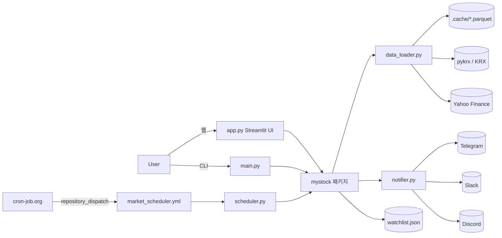

# 아키텍처

## 시스템 개요
myStock 은 AVWAP(앵커 거래량가중평균가)과 OBV 다이버전스 감지로 종목별 수급 흐름을 분석하고, 신호 발생 시 텔레그램/슬랙/디스코드로 자동 알림하는 개인용 주식 분석 도구다.
사용자(프로젝트 소유자 1인)는 Streamlit 웹 대시보드(app.py) 또는 CLI(main.py)로 직접 조회하거나, cron-job.org + GitHub Actions 를 통해 장마감 시간대에 자동 알림을 받는다.
별도 서버·DB 없이 로컬 프로세스와 GitHub Actions(잡 실행 시에만 기동)로 동작하며, 상태는 로컬 파일(watchlist.json, .cache/*.parquet)로만 저장한다.

## 구성도


## 레이어 의존 규칙
- 진입점(app.py, main.py, scheduler.py) → mystock/(핵심 로직) 방향으로만 의존한다. 진입점에는 화면·인자 처리·호출 조합만 둔다.
- mystock/ 패키지는 UI에 의존하지 않는다 — mystock/ 안에서 streamlit 을 import 하지 않는다 (20-python.md).
- mystock/ 내부는 역할별로 분리한다: 수집/캐시(data_loader.py, stock_cache.py), 분석(indicators.py, divergence.py, scanner.py), 표시(visualizer.py), 데이터(watchlist.py), 알림(notifier.py).
- DB 는 없다. 상태는 로컬 파일로 저장한다 — 관심종목은 watchlist.json, 시세는 .cache/*.parquet(재생성 가능한 캐시).

## 외부 연동
| 시스템 | 방식 | 담당 모듈 | 비고 |
|---|---|---|---|
| KRX 국내 시세 | `pykrx` 라이브러리 | mystock/data_loader.py | |
| Yahoo Finance 해외 시세 | Direct Chart API v8 우선 + `yfinance` 폴백 3단계 | mystock/data_loader.py | 속도 개선을 위해 Direct API 우선 (D-004) |
| 텔레그램 | Bot API | mystock/notifier.py | TELEGRAM_BOT_TOKEN, TELEGRAM_CHAT_ID (.env) |
| 슬랙 | Incoming Webhook | mystock/notifier.py | SLACK_WEBHOOK_URL (.env) |
| 디스코드 | Webhook | mystock/notifier.py | DISCORD_WEBHOOK_URL (.env) |
| GitHub Actions | `repository_dispatch` / `workflow_dispatch` | .github/workflows/market_scheduler.yml | 아래 "알림 실행 경로" 절 참고 |
| cron-job.org | 외부 정밀 크론 → GitHub API POST 호출 | 저장소 밖 (사용자가 콘솔에서 직접 관리) | `schedule:` 트리거를 대체 (D-001) |
| 데이터 저장 | 로컬 파일 | watchlist.json, .cache/*.parquet | **DB 없음** — 전부 파일 기반 |

## 알림 실행 경로

PC/서버를 상시 구동하지 않고, 외부 정밀 크론 서비스가 GitHub Actions를 원격 트리거하여 시장 마감 알림을 발송한다.

```
cron-job.org (정시 트리거)
  → POST https://api.github.com/repos/joonykims/myStock/dispatches
     (repository_dispatch, event_type: trigger-market-alert)
  → .github/workflows/market_scheduler.yml (repository_dispatch)
  → scheduler.py --now --days <lookback_days>
  → mystock/notifier.py (Telegram/Slack/Discord 브로드캐스트)
```

### 워크플로 트리거 (`.github/workflows/market_scheduler.yml`)
- `workflow_dispatch`: 수동 실행용. 입력값 `lookback_days` (string, 기본값 `'7'`) — GitHub Actions 웹 콘솔에서 사람이 직접 실행할 때 사용. **삭제 금지** — cron-job.org 트리거와 무관하게 언제든 수동 확인/재발송할 수 있는 수단으로 유지한다.
- `repository_dispatch`: cron-job.org 가 위 URL을 호출하는 정시 트리거. `event_type: trigger-market-alert`, 탐색 기간은 `client_payload.lookback_days`로 전달된다.
  - ⚠️ `repository_dispatch` 는 **기본 브랜치(main)에 이미 병합되어 있는 워크플로 파일 내용**으로만 실행된다. 다른 브랜치의 변경이나 아직 병합되지 않은 `market_scheduler.yml` 수정은 이 경로에 반영되지 않는다. 워크플로를 고쳤다면 main 병합 여부를 먼저 확인한다.
- 워크플로 내부에서 `DAYS="${{ github.event.inputs.lookback_days || github.event.client_payload.lookback_days || '7' }}"` 순으로 값을 취해 `python scheduler.py --now --days $DAYS` 를 실행한다.
  - **`lookback_days` 전달 경로 확인**: `repository_dispatch` 이벤트에서는 `github.event.inputs` 가 비어 있으므로(값 없음 → falsy) 이 식은 자동으로 `github.event.client_payload.lookback_days` 로 넘어간다. cron-job.org 요청 본문에 `client_payload.lookback_days` 를 포함하면 그 값이, 포함하지 않으면 기본값 `'7'` 이 쓰인다. 현재 워크플로 정의상 이 경로에서 값이 누락되는 문제는 없다.

> ⚠️ **`schedule:`(cron) 트리거는 의도적으로 제거함 — 재추가 금지 (cron-job.org와 중복 발송 위험).**

### 스케줄 (cron-job.org 콘솔 설정값)
| 작업명 | 실행 시각 (KST) | 실행 명령 |
|---|---|---|
|  |  |  |

> 위 표는 cron-job.org에서 사용자가 확인 후 기입한다.

### 인증
- cron-job.org에 GitHub PAT(Personal Access Token)를 저장하여 위 dispatch 호출에 사용한다.
- **fine-grained PAT** 사용을 권장하며, 대상 저장소 권한은 **Contents: Read and write** 로 제한하는 것을 권장한다.
- PAT의 발급·갱신·만료일 관리는 사용자가 직접 한다.

## 환경/프로필
| 프로필 | 용도 | 비고 |
|---|---|---|
| local | 개발 PC |  |
| dev | 개발 서버 |  |
| prod | 운영 | 에이전트 직접 작업 금지 |
